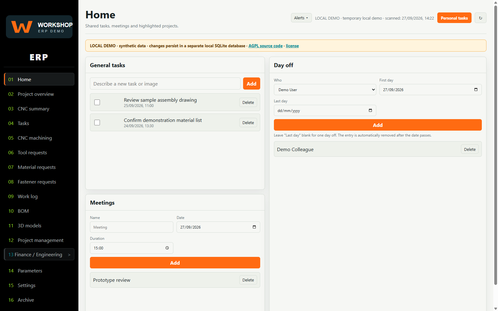
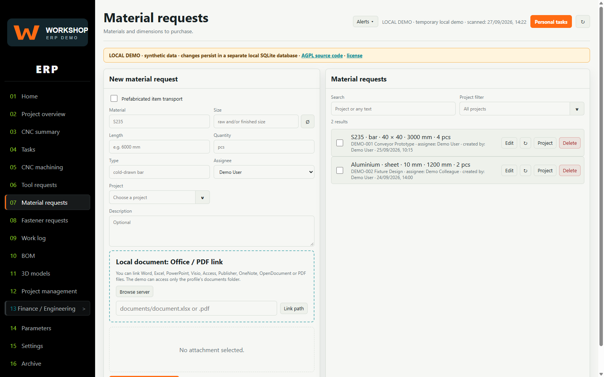
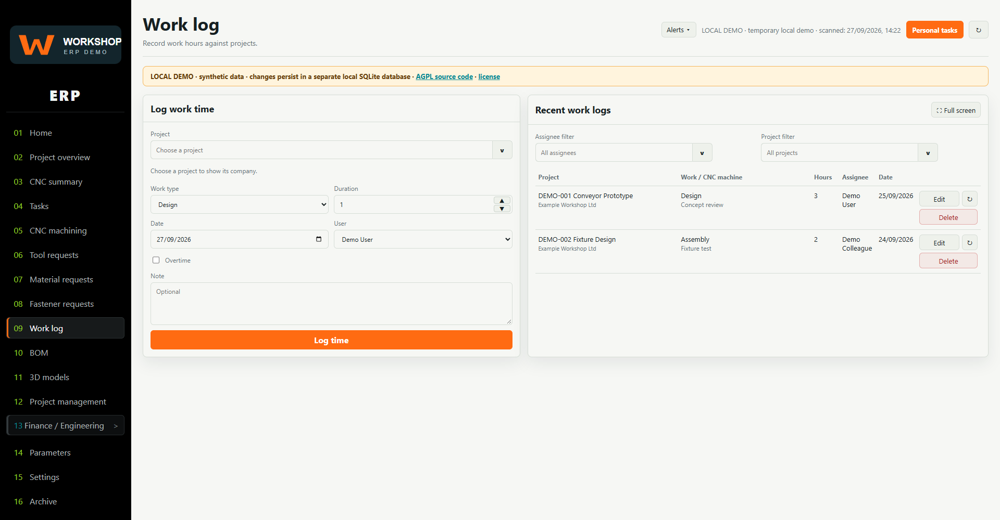
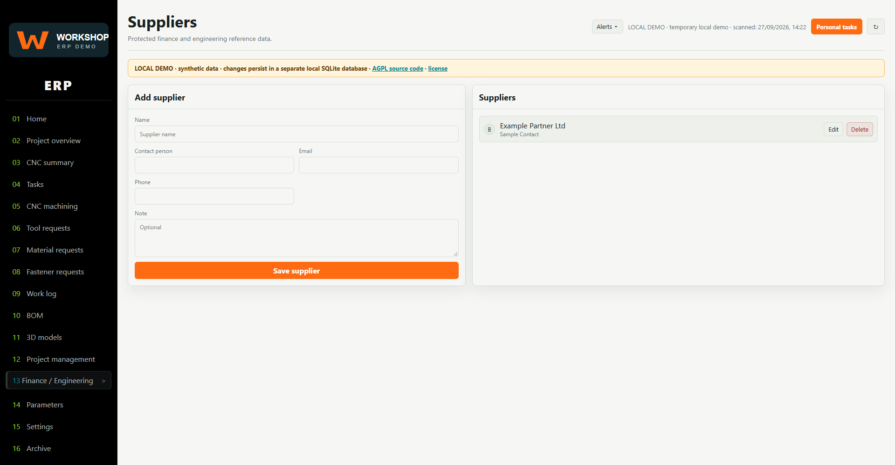
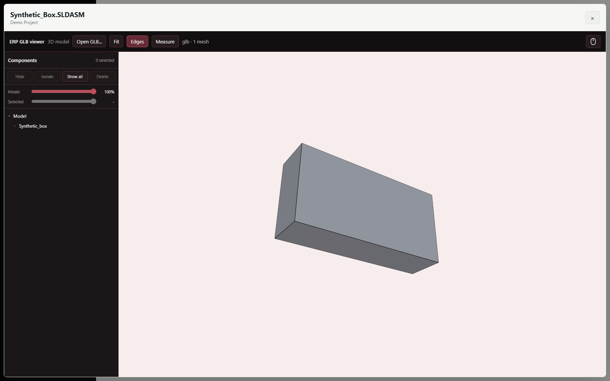
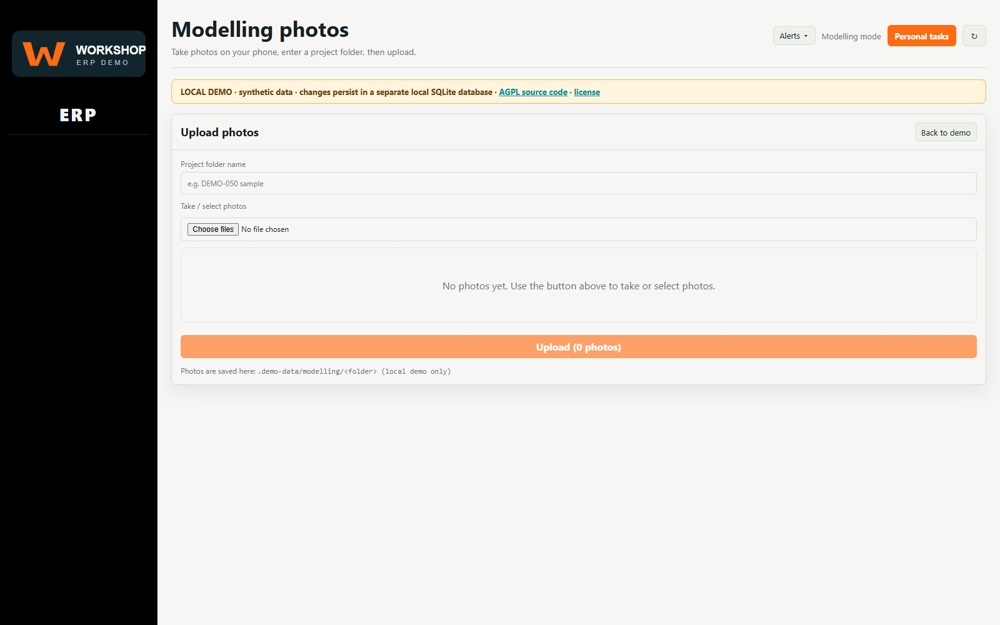
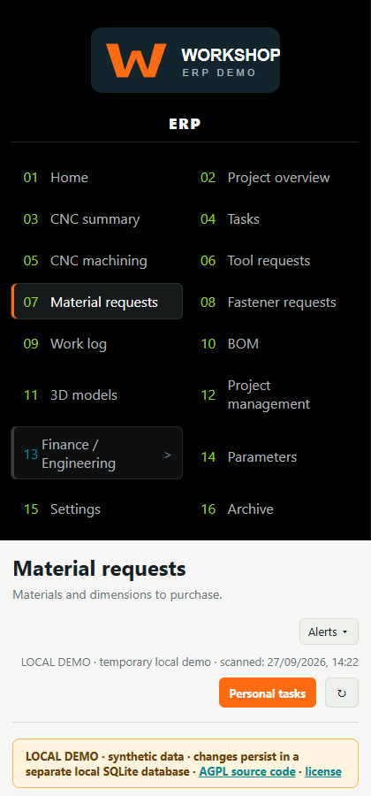

# Workshop ERP — localhost public-copy workbench

The [project page](https://simonsystem609.github.io/Workshop_ERP/) introduces
the synthetic screenshot gallery and the limits of this local demo.

This folder contains a generic, English-interface, synthetic-data ERP copy under development,
not the company's database. All 25 original menu views are present. It binds
only to `127.0.0.1` and stores edits in a separate persistent local SQLite
database. The default start command never imports the guarded original
backend or writes to a
production network share. It is not yet a secure hosted deployment or a
feature-complete clone.
The [ERP handoff](ERP-HANDOFF.md) explains how the source system is used
company-wide as a website for engineering projects and related operations,
and distinguishes that system from this local demo.









The [full 25-menu screenshot gallery](docs/images/README.md) and its four
function captures were taken from a separate synthetic localhost profile.
It includes the generated GLB cube in the 3D model list/viewer and a small
synthetic DXF in the project browser. No company database or live ERP page
was used for these images.

## Run

Install Node.js 22 or newer, then from this directory on a new installation:

```powershell
npm.cmd run setup
npm.cmd run check
npm.cmd start
```

Open `http://127.0.0.1:4777/` on **this PC**. No `npm install` is needed for
the server. `setup` copies the publishable
[`config.example.json`](config.example.json) to an editable `config.json` only
when the latter does not already exist; it never overwrites an installation.
Review that one config file before starting. To stop, press Ctrl+C in that
terminal. The first run seeds
`.demo-data/erp-demo.db` from `config.json`; later UI edits survive restarts.
Changing config seed values does not overwrite that existing database.
Do not run the copied `app/server.js` for this demo: it intentionally refuses
startup while its share, host, backup and account assumptions are being
adapted. The guarded source copy is included for review, not used by the
localhost app; see
[`app/ORIGINAL-BACKEND.md`](app/ORIGINAL-BACKEND.md).

The editable `config.json` is the single runtime configuration file for
the local demo and is Git-ignored; `config.example.json` is only its public
starter template. [`images/logo.svg`](images/logo.svg) is the fixed-name
branding/PWA asset. A synthetic GLB/JSON pair lives in the local
`imports/cadmodels` inbox; the matched viewer build and AGPL source are
included. Synthetic documents live under [`documents/`](documents/README.md),
which is the only file-browsing root for this profile. Details and a feature
matrix are in
[`CUSTOMIZE.md`](CUSTOMIZE.md).
The same config template now has a `futureHosting` deployment plan for
company-specific paths, proposed host ports, Cloudflare token-*file*
locations, a single-active-host watchdog, Helper and backups. It is
reference-only: the localhost server validates but never applies it, and
the guarded original backend does not read it. Filling every value does
not enable hosted operation.
Generic Windows launcher **wrappers** and a read-only host-plan checker are
included under [`hosting/`](hosting/README.md). These wrappers deliberately
refuse install/start/stop/restart/watchdog/tunnel actions; they are not the
private production launchers or a working multi-PC deployment.

A private installation can keep its own `config.json`, logo, documents and
SQLite data in a separate local profile directory outside this source tree.
Stop the generic demo before selecting that profile with `--config`. Never
commit the profile or treat it as a production credential backup.

## License

The intended public ERP source in this folder is licensed under
**AGPL-3.0-or-later**; see [LICENSE](LICENSE). The bundled GLB viewer uses
the same license. The viewer's bundled three.js code has a separate MIT
notice in `app/public/erp-glb-viewer/THIRD-PARTY-LICENSES.txt`.
The user confirmed company permission covers this exact C-only candidate,
including the guarded backend/Helper and approved images under that license.
This is a user attestation; it does not make the demo safe for hosted use or
replace a final check of changed release files.
The localhost app displays a source-code link on the login and main screens.
`/SOURCE.zip` contains the explicitly allowlisted ERP source, build scripts,
generic template, guarded original backend, viewer source, notices and a
SHA-256 file manifest; it never
includes the edited `config.json`, the SQLite database, or profile uploads.
Restart after changing source so the served bundle matches the running app.

## Current feature boundary

- All original menu views, including finance, archive, project management,
  parameters, settings, BOM, and 3D models.
- Persisted local CRUD for tasks, CNC tasks, requests, worklogs, projects,
  finance records, catalog entries, users, and archive/restore (display-only
  users by default; optional local credentials).
- Synthetic GLB import, project assignment, nickname, browser viewer, and
  deletion-free move of model files to profile-local `.demo-data/trash`.
- Profile-local document browsing/linking, Office/PDF request attachments,
  CNC worklog file links, and CSV/TXT/XLSX BOM links or uploads with a bounded
  simple parser. Both `documents/file.xlsx` and a path selected by the local
  server browser resolve inside the current profile.
- A profile-local project browser for drawing/CAD/PDF files under
  `documents/projects/<SHA-256 project ID>`. PDFs open in the browser; listed
  files download. The browser never scans Y: or creates a project from a
  folder. See [`documents/README.md`](documents/README.md).
- Profile-local PNG/JPEG/WebP images for dashboard todos, tasks, CNC tasks,
  and prefab material requests. Existing photos remain when a record is
  archived; no demo image file is automatically deleted.
- The special modelling-photo page opens from demo Settings. Its PNG/JPEG/WebP
  uploads go only to `.demo-data/modelling/<folder>` in the selected local
  profile, with no project creation or Y: path access.
- A profile-local JSON worklog inbox with explicit-user matching, per-entry
  errors, deduplication, and retained processed originals. See
  [`WORKLOG-IMPORT.md`](WORKLOG-IMPORT.md).
- Optional scanning of immediate project folders inside this profile's
  `documents/scanned-projects` tree. It keeps an existing project ID through a
  unique slight rename, treats differing project numbers as separate, warns
  after three complete missing scans, and never auto-archives. It is off in
  the generic demo; see [`CUSTOMIZE.md`](CUSTOMIZE.md).
- Optional local Tesseract OCR bridge for project-path and drawing-number
  camera crops. It is off by default, sends images only to a configured local
  executable through stdin, and stores no OCR photos. The external engine and
  language data are not bundled; see [`CUSTOMIZE.md`](CUSTOMIZE.md).
- Three simple XLSX export links, live SSE refresh, and network-pass-through
  PWA shell. Existing repeat/edit controls use the local API.
- A preserved, startup-disabled copy of the original backend and Helper
  source. `npm.cmd run original:fixture -- --out <new local absolute .db path>`
  creates a fresh original-schema SQLite file from the public sample template,
  including dummy in-app notices. It never copies the company's DB. The
  original backend still cannot be used as the demo server.

Helper, a bundled OCR engine,
push notifications, hosted authentication/security,
production/network project-folder scans, and the operational multi-PC watchdog/Cloudflare host stack are
**not yet implemented**. Unsupported API calls return HTTP 501. The Settings
view intentionally hides network-host controls. By default, the auto-selected
display user is *not* a real login. For an optional **localhost-only** password
trial, set `"security": { "mode": "local-password" }` in the profile's
`config.json` before starting. The configured `activeUserId` must be a visible
level-2 admin; the first visit creates that admin's unique 14+-character
password. Other users cannot sign in until the admin sets their passwords in
Settings. Credentials are salted/scrypt-hashed in that profile's local SQLite
DB, not stored in config. Removing the security setting after credentials
exist fails closed at startup. Sessions are memory-only and end on restart;
write requests require same-origin and a CSRF token. This is **not** a
multi-host or internet deployment. Do not expose either mode beyond localhost
or enter private data into a publishable profile.

## Tests and publication

Run `node tests/api-smoke.mjs` while the demo is running. It is read-only;
`npm.cmd test` uses isolated temporary profiles for write/persistence tests.
On this Windows PC, `node tests/browser-smoke.mjs --check-viewer --check-english`
visits all 25 views, checks their labels and several edit flows, and renders
the synthetic GLB in Chrome. Screenshots can be
regenerated intentionally with
`node tests/browser-smoke.mjs --refresh-screenshots` after backing them up.
With a synthetic profile running on localhost,
`node tests/browser-smoke.mjs --check-viewer --check-english --capture-all-menus` captures
new menu and read-only function images without overwriting existing files;
see the [gallery](docs/images/README.md).
`node tests/secure-browser-smoke.mjs` exercises first-run setup, logout, and
login in a fresh OS-temp secure profile without changing generic data or
screenshots. The retained OS-temp test profiles are not publication artifacts.
The browser test uses the installed Chrome, no downloaded packages, and a
separate profile under the Windows temp directory.

For a non-overwriting backup of an installation, stop the demo, create a
separate local backup parent directory, then run the following after replacing
the angle-bracket placeholders with absolute local directories:
`npm.cmd run backup:profile -- --config <demo-root>\config.json --out <backup-root>\snapshot-001`.
The command refuses an existing destination and writes a verified SQLite
snapshot plus profile files and a hash manifest; it never prunes older
backups. It does not restore files over an existing installation. See
[`CUSTOMIZE.md`](CUSTOMIZE.md) for scope and limits. A standalone source ZIP
for exact-file review can be built outside the project with
`npm.cmd run package:source -- --out <backup-root>\source-review-001.zip`.
That archive is not publication approval.

This repository contains the sanitized localhost demo source. The user
confirmed company permission for this candidate and approved
AGPL-3.0-or-later. The technical source, privacy, notice and localhost checks
are recorded in the release notes; repeat the exact staged-tree review for
future changes. See
[`PROVENANCE-LICENSING.md`](PROVENANCE-LICENSING.md) and
[`PUBLICATION-STATUS.md`](PUBLICATION-STATUS.md), plus the limited
[`PRIVACY-REVIEW.md`](PRIVACY-REVIEW.md). This is a partial localhost demo
with staged fail-closed host wrappers, not a deployable Cloudflare or multi-PC ERP.
